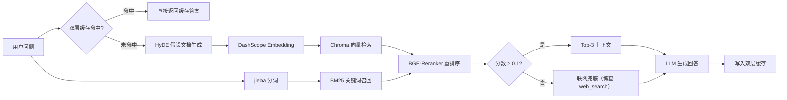
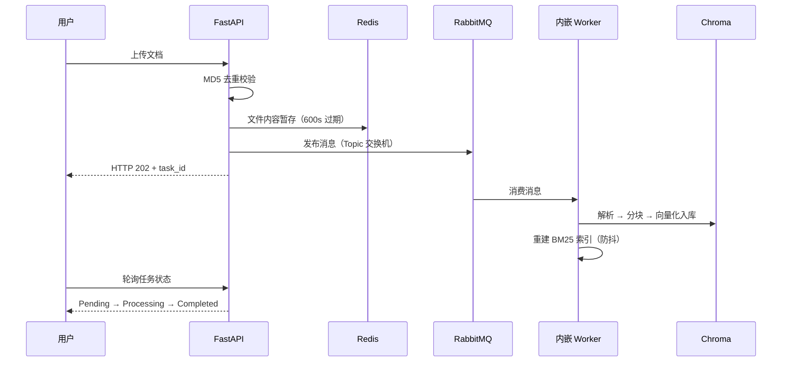

# DevSage · 研发智库

[](https://github.com/orange-orunji/devSage/actions/workflows/test.yml)

面向研发团队的技术知识库 Agent——基于 FastAPI + **LangGraph** + Vue 3 + Chroma + RabbitMQ + Redis 构建。让工程师在散落的技术规范、方案与复盘文档里**秒级找到答案**，并完成从检索到交付（报告生成 / 格式转换 / 邮件发送）的完整闭环。

---

## 📑 目录

- [项目背景](#-项目背景)
- [演示](#-演示)
- [技术架构](#-技术架构)
- [核心亮点](#-核心亮点)
- [检索策略对比](#-检索策略对比)
- [性能压测](#-性能压测)
- [项目结构](#-项目结构)
- [快速开始](#-快速开始)
- [Docker 一键部署](#-docker-一键部署)
- [常见问题](#-常见问题)
- [更新日志](#更新日志)

---

## ⭐ 项目背景

面向研发团队的知识管理场景：技术规范、方案设计、复盘文档散落在各处——新人上手慢、老人重复踩坑。DevSage 提供文档检索问答、报告生成、格式转换、邮件发送等一站式能力，用自然语言驱动 Agent，完成从信息查询到文件交付的完整闭环。

## 📺 演示

> 真实运行录屏，原速截取展示三个核心场景（引用来源 / 交付闭环 / 人工审批）。

**① 知识库问答 + 来源引用**


**② 报告生成 + 一键下载**


**③ 邮件发送人工审批（HITL）**


## 🧱 技术架构

```
浏览器（Vue 3 前端 · Vite 构建产物） 
│ ▼ FastAPI 服务（单进程托管 API + 静态资源） 
├── JWT 认证 → SQLite 用户存储 
├── SSE 流式对话
│   ├── 🤖 Agent 智能体（主路径）─ LangGraph 自定义 StateGraph
│   │   ├── 🧭 图编排 ─ 三分类路由 → 前置检索（质量阈值）→ 联网兜底 → ReAct 工具循环
│   │   ├── search_knowledge_base ─ HyDE + 向量 + BM25 + Rerank 全流程检索
│   │   ├── upload_document ─ 文档内容异步入库（RabbitMQ）
│   │   ├── delete_document ─ 文档删除（Chroma/MD5/BM25 联动清理）
│   │   ├── get_document_status ─ 知识库统计 + 关键词过滤
│   │   ├── generate_report ─ 检索 + LLM 汇总 → Markdown 报告
│   │   ├── convert_format ─ 报告格式转换（md/txt/docx）
│   │   └── send_email ─ interrupt 人工审批 → SMTP 邮件发送 + 附件支持
│   └── RAG 链（备选路径）─ LCEL + RunnableWithMessageHistory
│       ├── HyDE 假设文档生成 
│       ├── Chroma 向量检索（DashScope Embedding） 
│       ├── BM25 关键词索引（jieba 分词） 
│       └── BGE-Reranker Cross-Encoder 重排序 
├── 双层缓存 
│ ├── MD5 精确匹配缓存（Redis） 
│ └── 语义相似度缓存（Faiss-like 内存向量） 
├── 文档异步上传 
│ ├── RabbitMQ Topic 交换机 
│ ├── 文件内容 Redis 暂存（600s 过期） 
│ └── 内嵌 Worker 异步消费 
├── 会话记忆持久化（LangGraph Checkpointer · AsyncSqliteSaver） 
└── 对话历史持久化（JSON 文件按用户/会话隔离）
```

> 前端为 Vue 3 + Vite 单页应用（组件化拆分 + 响应式数据驱动），构建产物由 FastAPI 直接托管，无需额外进程；未构建时自动回退旧 HTML 前端（`app/static/`）。

### 🔍 检索链路



### 📤 文档异步上传链路



## ✨ 核心亮点

- **多格式文档解析**：支持 PDF、Word(.docx)、Markdown、TXT 文件自动解析与向量化
- **Agent 自主决策**：7 个 Function Calling 工具，自动选择检索/上传/删除/统计/报告生成/格式转换/邮件发送
- **报告生成 + 下载**：Agent 检索知识库 → LLM 汇总 → 保存 Markdown → SSE 推送下载按钮
- **文件格式转换**：支持 md → docx / txt / md 互转，Markdown 语法自动清洗
- **邮件发送（人工审批）**：`send_email` 执行前 LangGraph interrupt 中断挂起，SSE 推送审批卡片，用户确认后 resume 恢复发送；SMTP 支持正文 + 附件（QQ 邮箱 / 企业邮箱）
- **三阶混合检索**：**HyDE（假设文档嵌入）** 语义扩展 → **BM25 关键词召回** → **BGE-Reranker 重排序**，覆盖模糊语义与精确关键词两种场景
- **异步文档处理**：基于 RabbitMQ 消息队列的异步上传架构，文件内容临时存于 Redis，内嵌 Worker 后台消费，接口即时响应（HTTP 202）
- **上传任务追踪**：文档上传后通过 task_id 轮询处理状态（Pending → Processing → Completed/Failed）
- **文档 MD5 去重**：上传时自动检测内容 MD5，避免相同文档重复入库，同时重建 BM25 全量索引
- **双层热点缓存**：MD5 精确匹配（Redis）+ 语义相似度匹配（内存向量 LRU 上限 200 条），缓存命中时延迟从 ~20s 降至 ~0.01s；工具调用轮不写缓存 + 动作指令（删除/上传/发送等）跳过缓存查找，杜绝“假成功”与状态陈旧（冒烟 6/6）
- **真·Token 级流式输出**：基于 `astream_events` 逐 token 推送 + SSE JSON 编码无损传输（代码块 `\n` 不被误还原），前端打字机效果 + Markdown 实时渲染（表格/代码块/标题/列表）；工具调用提示独立展示不混入回答；渲染前表格规范化（相邻表格自动补空行）
- **来源引用（可解释 AI）**：检索片段注入【来源：文件名】头 + Prompt 引用标注要求，回答句末标注来源并列出引用来源，来源由检索层保证而非模型凭空编造
- **多轮对话记忆（LangGraph Checkpointer）**：Checkpointer + AsyncSqliteSaver 接管会话记忆并持久化（重启不丢），thread_id 按“用户+会话”隔离；历史注入重构为增量模式（防重复），会话删除/重命名与会话记忆联动清理
- **敏感操作人工审批（Human-in-the-loop）**：`send_email` 等敏感工具执行前 interrupt 中断（结构化 payload 审批卡）；待审批期间新消息被入口防呆拦截、输入区锁定；审批状态持久化于 checkpointer，切会话/刷新/换设备均可恢复卡片；确认/取消后 resume 恢复执行
- **检索前置硬约束（自定义 StateGraph）**：Agent 从预置 `create_react_agent` 重构为自定义 `StateGraph`——“先检索知识库”由 Prompt 规则升级为**图的必经节点**（三分类路由：寒暄/动作类跳过，其余默认强制）；Rerank 质量阈值（≥0.1，数据实测：相关 ≥0.42 / 不相关 0.00）过滤低质结果；知识类问题检索覆盖率 100%，动作类请求耗时降低 86%（10.8s → 1.5s）
- **联网搜索兜底（web_search）**：本地检索质量不足（Rerank 分数 < 0.1）时条件边自动切换博查联网搜索，回答标注【网页：标题】URL + 发布日期；reset 入口节点保证上下文每轮重置（防跨轮残留）；知识库/联网/通用知识三级标注体系清晰可追溯
- **Agent 端到端评测体系**：`app/eval_agent.py` 38 题五分类评测集（知识库/工具动作/联网/记忆/社交，含多轮指代/长窗口/防呆等压力题）——全自动断言（工具命中对照流内提示、引用正则、联网“标记 + 真实链接”双证据、关键词子串，零 LLM judge）、分组成功率与分类别延迟报告、断点续跑（改哪测哪）；配套 `scripts/` 维护工具（清缓存/断点管理）与一键重测脚本；基线 38/38（100%）
- **记忆窗口与记忆类三层防御**：`trim_messages` 滑动窗口（发送封顶 20 条、`start_on="human"` 保工具对与轮次完整，工具密集对话裁剪零异常）；记忆类问句三层防御（缓存读侧拦截 + 写侧不缓存 + 跳过前置检索），修复“记忆类问句命中缓存返回陈旧答案”缺陷；router 数学跳过（“1+1”类 11.2s → 2.5s 直答）
- **多用户认证与隔离**：JWT 认证 + HTTP Bearer Token，用户数据完全物理隔离
- **会话管理**：新建、切换、重命名、删除会话，每个会话独立保持上下文
- **查询意图路由器**：三层漏斗路由（正则精确标记 → 语料 IDF 稀有词信号 → 默认语义），300 题评测下语义组 75.3% / 精确组 86.0% 正确分流，检索层 Recall@1 59.67% 反超全量混合基线 2pp
- **量化评估体系**：内置 Recall@K、MRR 自动化评测脚本与 300 条分类评测集（semantic/keyword 各 150），支持多种检索策略对比与路由阈值校准
- **Vue 3 组件化前端**：Vue 3 + Vite 构建，登录/会话/聊天/审批卡片组件化拆分 + composables 状态管理（useAuth / useSessions / useMessages）；响应式数据驱动渲染（流式消息与审批状态机单一数据源），SSE 打字机 + Markdown 实时渲染等价移植；构建产物由 FastAPI 托管（旧 HTML 前端保底回退），开发期 Vite 热更新 + /api 代理联调

## 📊 检索策略对比（Top-1 召回率）

| 策略 | 纯模糊问题 (30) | 混合问题 (30模糊+13精确) |
|------|----------------|--------------------------|
| Baseline (向量) | 53.33% | 41.86% |
| HyDEOnly | 60.00% | 51.16% |
| HyDE + Rerank | **66.67%** | **48.84%** |
| HyDE + BM25 + Rerank | 50.00% | 39.53% |

> ⚡ 核心发现：HyDE+Rerank 在语义模糊场景下提升最显著。详细实验分析见 [`EVALUATION.md`](./EVALUATION.md)。

### 🧭 查询意图路由校准（300 条评测集，38 切片语料）

| 分组 | 路由判定正确率 | 说明 |
|------|--------------|------|
| 语义组（150 条） | 75.3% | CN_FACT_PATTERN 句式层将部分“为什么”句引入精确通道（双路为单路超集，检索层实测无损失） |
| 精确组（150 条） | 86.0% | 中文精确句式模板上线后大涨（60.67% → 86.00%） |

> 💡 路由器校准脚本 `app/eval_router.py`，评测集 `app/eval_questions.json`（type 标注 semantic/keyword）。分类正确率只是代理指标，最终收益以 Recall@K 对比为准——38 切片实测 adaptive 59.67% vs 全量混合 57.67%，详见 [`EVALUATION.md`](./EVALUATION.md) 实验三。

## ⚡ 性能压测（2026-08-14 实测）

> 环境：Windows 11 + Python 3.14 单进程，限流关闭（压测需绕过 10/min 限流），无 Redis 缓存；httpx 异步并发脚本实测。

| 场景 | 并发 | 请求数 | 吞吐 | 均值 | P95 | P99 |
|------|------|--------|------|------|-----|-----|
| GET /health | 100 | 300 | **884 req/s** | 94ms | 125ms | 135ms |
| POST /api/auth/login（含 JWT 生成 + 密码校验） | 50 | 100 | **233 req/s** | 181ms | 261ms | 272ms |
| 对话端到端（检索 + 双 LLM 调用，无缓存） | 3 | 3 | 并行 18.8s | **14.5s** | 18.8s | 18.8s |

**关键结论**：
- API 层（FastAPI 异步）吞吐充足，瓶颈远未到框架层
- 对话延迟主要来自 LLM 流式生成（每问 2 次模型调用：Agent 推理 + 最终回答），3 并发无劣化
- 缓存命中场景（Redis + 语义缓存）可将对话延迟从 ~14.5s 降至 ~0.01s（见「双层热点缓存」）

## 📂 项目结构

```
RAG_Personal/
├── main.py                          # 入口：FastAPI + 内嵌 Worker + 托管前端
├── scripts/                         # 开发工具链
│   ├── maintenance.py               # 清缓存 / 评测断点管理（CLI）
│   └── rerun.ps1                    # 一键重测（停服务→启动→等就绪→清缓存→重跑）
├── app/
│   ├── api/                         # 接口层
│   │   ├── auth.py                  # 注册/登录
│   │   ├── chat.py                  # SSE 流式对话、会话管理、人工审批（resume/pending）
│   │   └── document.py              # 文档异步上传
│   ├── agent/                       # Agent 智能体
│   │   └── agent.py                 # 自定义 StateGraph（路由/前置检索/联网兜底/记忆窗口）+ 工具注册 + Checkpointer 注入
│   ├── services/                    # 业务层
│   │   ├── tools/                   # Agent 工具集
│   │   │   ├── status_tool.py       # 知识库统计 + 报告生成 + 格式转换 + 邮件发送
│   │   │   ├── search_tool.py       # 知识库检索工具
│   │   │   ├── delete_tool.py       # 文档删除工具
│   │   │   ├── web_search_tool.py   # 联网搜索（博查；纯函数 + @tool 双层复用）
│   │   │   └── upload_tool.py       # 文档上传工具
│   │   ├── llm.py                   # RAG 链（LCEL）
│   │   ├── hyde.py                  # HyDE 检索增强
│   │   ├── bm25_service.py          # BM25 关键词索引
│   │   ├── rerank.py                # BGE-Reranker 重排序（分数落 metadata，供质量阈值过滤）
│   │   ├── vector_store.py          # Chroma 向量库
│   │   ├── history_service.py       # 对话历史持久化
│   │   ├── document.py              # 文件解析 + 校验
│   │   └── KnowledgeBase_md5_service.py  # MD5 去重 + 入库
│   ├── schemas/                     # Pydantic 模型
│   ├── config/settings.py           # 环境配置
│   ├── utils/                       # 工具模块
│   │   ├── auth.py                  # JWT + 密码哈希
│   │   ├── logging_config.py        # 统一日志配置（控制台 + 文件轮转）
│   │   ├── SQL_database.py          # SQLite 连接
│   │   ├── task_handler.py            # 公共文档处理 + BM25 防抖重建
│   │   ├── redis_client.py          # Redis 客户端
│   │   ├── rabbitmq.py              # RabbitMQ 客户端
│   │   ├── semantic_cache.py        # 语义缓存
│   │   └── task_status.py           # 任务追踪
│   ├── data/                         # 持久化数据
│   │   ├── storage/                  # ChromaDB + MD5 记录
│   │   ├── chat_history/             # 对话历史文件
│   │   └── report/                   # 生成的报告文件
│   ├── static/index.html            # 旧 HTML 前端（Vue 未构建时保底回退）
│   ├── eval_retrieval.py            # 检索层评测（Recall@K / MRR）
│   ├── eval_router.py               # 路由器意图判定校准
│   ├── eval_questions.json          # 300 条分类评测集
│   ├── eval_agent.py                # Agent 端到端评测（五分类成功率 + 断点续跑）
│   ├── eval_agent_questions.json    # Agent 评测集（38 题五分类，含压力题）
│   └── worker.py                    # 独立 Worker（可选）
├── frontend/                         # Vue 3 前端（Vite 构建）
│   ├── src/
│   │   ├── App.vue                  # 登录页 ⇄ 聊天页
│   │   ├── views/                   # LoginView / ChatView
│   │   ├── components/              # Sidebar / ChatArea / ApprovalCard
│   │   ├── composables/             # useAuth / useSessions / useMessages（状态与 SSE 消费）
│   │   ├── utils/format.js          # Markdown 渲染 + 表格规范化
│   │   └── styles/style.css         # 设计系统（原 CSS 整体复用）
│   ├── vite.config.js               # /api、/reports 代理到后端（dev 模式）
│   └── package.json
├── models/bge-reranker-base/        # Reranker 模型
├── requirements.txt
└── .env.example
```

## 🚀 快速开始

### 1. 环境准备

```bash
# 克隆项目
git clone <你的仓库地址>
cd RAG_Personal

# 创建虚拟环境
python -m venv .venv
# Windows
.venv\Scripts\activate
# macOS / Linux
source .venv/bin/activate

# 安装依赖
pip install -r requirements.txt
```

### 2. 下载模型

```bash
python downLoad_models.py
```

### 3. 配置环境变量

复制 `.env.example` 为 `.env`，并填入你的 API Key：

```bash
cp .env.example .env
```

`.env` 文件内容示例：

```ini
SILICON_API_KEY=你的API_KEY
DASHSCOPE_API_KEY=你的API_KEY
SILICON_BASE_URL=https://api.deepseek.com
SILICON_MODEL=deepseek-chat

# 邮件发送（可选，使用邮件功能时需要）
SMTP_HOST=smtp.qq.com
SMTP_PORT=587
SMTP_USER=你的QQ号@qq.com
SMTP_PASSWORD=QQ邮箱授权码

# 联网搜索（可选，使用联网兜底功能时需要；博查开放平台 bochaai.com）
BOCHA_API_KEY=你的博查API_KEY
```

### 4. 启动 Redis（使用缓存功能时需要）

**Windows（Docker）**：
```bash
docker run -d -p 6379:6379 redis
```

**macOS / Linux**：
```bash
redis-server
```

### 5. 运行项目

> ⚠️ **启动顺序**：先启动 RabbitMQ 和 Redis，再启动后端（`main.py`）。若首次启动时 RabbitMQ 不可用，异步上传功能会禁用且**不会自动恢复**——需重启后端服务。

```bash
# 一键启动（前端 + 后端同一进程，访问 http://127.0.0.1:8000）
python main.py

# 如端口被占用，指定其他端口
python -m uvicorn main:app --host 127.0.0.1 --port 9000
```

浏览器访问 `http://127.0.0.1:8000` 即可体验（根路径默认加载 Vue 前端）。

> **注意**：Vue 构建产物（`frontend/dist`）由 FastAPI 自动托管；未构建时自动回退旧 HTML 前端（`app/static/`）。前端源码改动后需 `cd frontend && npm run build` 重新构建生效。旧版 Streamlit 前端（`app/ui.py`）仍保留可用。

**前端开发模式（可选，热更新）**：

```bash
# 终端 1：后端
python main.py

# 终端 2：前端（Vite dev server：5173 端口，/api 与 /reports 自动代理到 8000）
cd frontend
npm install    # 首次
npm run dev
```

### 6. 开发工具（评测与一键重测）

```powershell
# 一键重测：改完代码后（自动：停旧服务 → 启动最新代码 → 等就绪 → 清缓存 → 重跑指定题）
.\scripts\rerun.ps1 7,8,9        # 只重跑第 7/8/9 题
.\scripts\rerun.ps1              # 全量 38 题

# 维护命令
python scripts\maintenance.py clear-cache      # 清 Redis 缓存
python scripts\maintenance.py retry 7,8,9      # 管理评测断点（重跑指定题）
```

> `rerun.ps1` 管理的服务端口为 8010（`app/eval_agent.py` 的评测目标）；服务无需手动先启动。

## 🐳 Docker 一键部署

不想手动装环境？一条命令拉起全套（Redis + RabbitMQ + Worker + API）：

```bash
# 1. 配置 API Key（必填）
cp .env.example .env   # 填入 SILICON_API_KEY / DASHSCOPE_API_KEY

# 2. 下载 Reranker 模型到 models/ 目录（首次需要，会被打包进镜像）
python downLoad_models.py

# 3. 一键启动
docker compose up -d --build
```

| 服务 | 地址 |
|------|------|
| 🌐 应用前端 + API | http://localhost:8001 |
| 🐰 RabbitMQ 管理台 | http://localhost:15673（rag / rag123456） |
| 🗄️ Redis | localhost:6380 |

> 💡 说明：`docker-compose.yml` 已通过 `env_file` 注入你的 `.env`，API Key 无需重复配置；向量库、对话历史、会话记忆（checkpoints.db）、报告文件均通过 volume 持久化到宿主机 `app/data/`，容器重建不丢数据。

> 🏗️ 镜像采用三阶段构建（frontend → builder → runtime）：前端在镜像内完成 `npm install && npm run build`（无需本地预先构建），依赖分层缓存加速重建。

## 🔧 常见问题

| 问题 | 解决方法 |
|------|---------|
| 端口 8000 被占用 | `netstat -ano \| findstr :8000` 查看 PID，`taskkill /F /PID <号>` 释放 |
| 页面加载不出来 | 确认已执行 `pip install aiofiles`，重启后端 |
| 页面显示旧版界面 | 浏览器强刷（Ctrl+F5）；Vue 产物未构建时会回退旧 HTML 前端，执行 `cd frontend && npm run build` 后重启 |
| 重命名会话失败 | 需先发送一条消息创建会话文件，或刷新页面后重试 |
| RabbitMQ 连接失败 | 检查 vhost 用户权限是否为 `.*`（正则），不能只用 `*` |
| 上传功能禁用（日志提示） | RabbitMQ 首次连接失败后需**重启后端**才能启用；运维顺序应为先启动 RabbitMQ / Redis，再启动后端 |
| 文档上传后无响应 | 检查 RabbitMQ 是否运行，Redis 是否可连接（文件内容通过 Redis 传递） |
| Redis 连接失败 | 缓存功能自动降级，不影响核心问答；启动 Redis 后重启服务即可启用 |
| 邮件发送失败 | 检查 `.env` 中 SMTP 配置是否正确，QQ 邮箱需使用授权码而非登录密码 |
| 联网搜索提示额度不足 | 博查开放平台检查套餐/额度；未配置 `BOCHA_API_KEY` 时自动跳过联网（不影响知识库问答） |
| 报告下载按钮不显示 | 确保 `app/data/report/` 目录存在，重启服务后自动创建 |

# 更新日志

格式基于 [Keep a Changelog](https://keepachangelog.com/zh-CN/1.0.0/)，版本号遵循 [语义化版本](https://semver.org/lang/zh-CN/)。

| 版本 | 日期         | 关键变更 |
|------|------------|---------|
| **1.13.1** | 2026-09-20 | 品牌定位收窄 + 报告下载链接修复：项目更名 **DevSage · 研发智库**——定位从“企业办公助手”收窄为“面向研发团队的技术知识库 Agent”（README/前端/系统提示词全链路文案统一）；修复报告下载链接损坏缺陷（根因：LangGraph v2 事件 `on_tool_end` 的 output 为 ToolMessage 对象，`str()` 得到 repr 导致换行被转义、`split("\n")` 截取失效，filename 混入 tool 元数据；修复：读取 `output.content` + 文件名白名单校验，非法时告警跳过）；评测加固：两道报告题补充 `/reports/` 链接断言（覆盖此前评测盲区） |
| **1.13.0** | 2026-09-16 | Agent 端到端评测上线 + 记忆窗口 + 记忆类三层防御：新增 `app/eval_agent.py` 五分类评测（知识库/工具动作/联网/记忆/社交，38 题含压力题）——全自动断言（工具命中/引用/联网双证据/关键词）、零 LLM judge、分组报告与分类别延迟、断点续跑，基线 38/38（100%）；`trim_messages` 记忆窗口（发送封顶 20 条，`start_on="human"` 保工具对完整，早前轮次出窗失忆、工具密集对话零异常）；记忆类问句三层防御（缓存读侧拦截 + 写侧不缓存 + 跳过前置检索，修复陈旧答案）；router 数学跳过（1+1 类 11.2s→2.5s）；prompt 话术治理（对话人设 + 数据规则 + few-shot 正例，temperature=0.3）与联网可观测性修复（web 节点日志占位符 bug + 失败留痕）；配套 `scripts/` 工具链（maintenance.py + rerun.ps1 一键重测） |
| **1.12.0** | 2026-09-15 | LangGraph 二期收官·检索前置硬约束 + web_search 联网兜底：自定义 StateGraph 替换 create_react_agent——三分类路由（寒暄/动作类跳过）→ 检索为图必经节点（默认强制）→ ReAct 工具循环；Rerank 分数落 metadata + 质量阈值（0.1）过滤低质结果，检索不足自动切换博查联网搜索兜底（回答带网页 URL/日期标注）；reset 入口节点实现上下文每轮重置（防跨轮残留）；收益：知识问题检索覆盖 100%、动作类请求 10.8s→1.5s、统计类 12.2s→3.2s；验收（编译/联网兜底/知识命中/多轮残留/审批中断）全绿 |
| **1.11.0** | 2026-09-13 | 前端工程化升级：原生 HTML/JS 前端迁移至 **Vue 3 + Vite**（登录/会话/聊天/审批卡片组件化拆分 + composables 状态管理；SSE 流式消费与 Markdown 渲染等价移植）；FastAPI 托管构建产物（旧 HTML 前端保底回退）、Docker 三阶段构建（镜像内 npm build）、开发期 Vite 热更新代理；同步修复 slowapi ASGI 中间件对多块响应重复发送 http.response.start 的隐患（改装饰器模式，请求日志零异常）；历史消息 role 契约归一化（human → user）；托管链路实测全绿 |
| **1.10.0** | 2026-09-13 | LangGraph 二期·人机协同审批（HITL）：`send_email` 工具内 interrupt（结构化 payload）→ SSE 中断帧 + 入口防呆拦截 + `/resume` 恢复接口 + `/pending` 待审批查询；前端审批卡片（确认/取消）+ 输入锁定 + 切会话/刷新全场景重建（UI 无状态、状态在 checkpointer）；验收（挂起/拒绝/通过/防呆/恢复）全绿，真邮件送达 |
| **1.9.0** | 2026-09-12 | LangGraph 二期·Checkpointer 多轮记忆落地：`AsyncSqliteSaver` 接入 FastAPI lifespan（重启记忆不丢）、thread_id 按“用户+会话”隔离、历史注入割接增量模式、会话删除/重命名联动清理记忆；同步修复语义/ MD5 缓存未按会话隔离的跨会话复用缺陷；验收（多轮/隔离/删除联动/重启持久化）全绿 |
| **1.8.6** | 2026-09-07 | 语义缓存白名单修复：动作指令（删除/上传/发送等 13 词）读侧拦截跳过缓存查找 + 工具调用轮写侧不写缓存（`not tool_times`），修复“删除指令命中缓存返回假成功”与“统计/检索回答状态陈旧”；冒烟 6/6 通过（同文删除两次均真实执行、删除后同文统计返回新状态、纯问答二次命中缓存正常） |
| **1.8.5** | 2026-09-07 | 工具集补缺口：新增 `delete_document` 删除工具（Chroma 切片 + MD5 记录 + BM25 索引三处联动清理，删除后同内容可重新上传，实测 8/8 通过）+ 检索来源注入 citation（工具返回带【来源：文件名】头 + Prompt 引用标注，回答句末标注来源） |
| **1.8.4** | 2026-09-07 | LangGraph 一期迁移：预置 `create_react_agent` 替换 `AgentExecutor`（移除 langchain-classic 依赖）+ 对话输入改 `messages` 约定 + `astream_events` v1→v2 事件协议升级（消除弃用警告）；冒烟验证（token 流式/工具提示/多轮追问）7/7 通过 |
| **1.8.3** | 2026-08-14 | 统一日志（`logging_config.py` 文件轮转 + HTTP 请求中间件 + 工具调用/输出帧埋点）；压测量化（/health 884 req/s、登录 233 req/s、端到端 14.5s）；多轮对话 Agent 路径实测验证；安全加固（.env 解除 git 跟踪、JWT 密钥环境变量化） |
| **1.8.2** | 2026-08-13 | 流式输出修复：`astream_events` token 级流式（帧数 2→524）+ SSE JSON 编码（修复代码块 `\n` 误还原）+ 前端 normalizeTables v2（相邻表格/说明文字吞并）+ 工具提示独立渲染 + Prompt 表格规范 |
| **1.8.1** | 2026-08-13 | 检索策略自适应二期：CN_FACT_PATTERN 中文精确句式 + adaptive_retrieve 全量接入（工具/LLM 双入口）+ RRF 融合；38 切片评测 adaptive 59.67% 反超全量混合基线 2pp；Embedding 统一工厂（text-embedding-v4 按量付费回切）；上传链路修复（失败重试不再必失败 + 死信队列声明） |
| **1.8.0-alpha** | 2026-08-04 | 检索策略自适应一期：BM25 服务单例化（修复索引空转 bug）+ 查询意图路由器（正则 + IDF 三层漏斗）+ 评测集扩至 300 条并支持 type 分组 + 路由校准脚本 |
| **1.7.0** | 2026-07-17 | 工程化加固：Agent 上传走消息队列、语义缓存 LRU 限制、BM25 防抖重建、CORS 拆分、空壳清理、检索全链路耗时日志、API 响应 Schema 补全 |
| **1.6.0** | 2026-07-15 | 智能办公助手：报告生成 + 格式转换 + 邮件发送 + 附件支持 |
| **1.5.0** | 2026-07-14 | Agent 升级：Function Calling 工具封装 + AgentExecutor 串联 + 多轮会话记忆 + DeepSeek 模型切换 |
| **1.4.0** | 2026-07-09 | 工程化加固 |
| **1.3.0** | 2026-06-28 | RabbitMQ 异步文档上传 + 任务状态追踪 + 语义相似度缓存 + 独立 Worker 进程；Redis 懒加载降级 |
| **1.2.0** | 2026-06-27 | HTML 单页前端替代 Streamlit；SSE 流式 + Markdown 渲染；BM25 关键词检索；MD5 去重；会话管理增强 |
| **1.1.0** | 2026-06-20 | HyDE 假设文档检索 + BGE-Reranker 重排序；JWT 多用户认证；多格式文档解析；LCEL 链式 RAG |
| **1.0.0** | 2026-06-15 | 项目初始化：FastAPI + LangChain + Chroma + DashScope；文档上传与问答；Recall@K/MRR 评测；Streamlit 原型 |

### 🗺️ 路线图

**Agent 评测体系（✅ 2026-09-16）**

> 在检索层评测（300 条 Recall@K/MRR）之上补齐 Agent 端到端评测：五分类 38 题（知识库/工具动作/联网/记忆/社交，含多轮指代/长窗口/防呆等压力题）、全自动断言（工具命中/引用/联网双证据/关键词，零 LLM judge）、分组成功率与分类别延迟报告、断点续跑（改哪测哪）；配套维护工具（清缓存/断点管理）与一键重测脚本。**基线：38/38（100%），平均 ~17s；最近复验 2026-09-27 全量重跑 38/38（平均 18.1s / P95 46.0s）——期间遭遇 LLM API 余额中断（402）导致 15 题环境性失败，凭断点续跑仅重测失败题恢复全绿，另有 1 题偶发 ReadTimeout 单题重试即过，实战验证了断点续跑与失败归因三分类的有效性。** 方法论沉淀：失败归因三分类（产品缺陷 / 评测题超纲 / 评测器误判）、“探针先行、现场取证”的排查流程，以及评测基础设施加固（限流节流/异常容错/观察题防假通过）。

**前端工程化（✅ 已完成 2026-09-13）**

> 原生 HTML/CSS/JS 单页前端迁移至 **Vue 3 + Vite**：组件化拆分（登录/侧栏/聊天/审批卡片）、composables 状态管理（useAuth / useSessions / useMessages）、响应式数据驱动渲染（流式消息与审批状态机单一数据源）；构建产物由 FastAPI 托管、旧前端保底回退；Docker 三阶段构建（镜像内 npm build）；开发期 Vite 热更新 + /api 代理联调。

**LangGraph 迁移（一期 ✅ 2026-09-07 · 二期 ✅ 2026-09-15，全部完成）**

> 一期成果：引入 `langgraph`，预置 `create_react_agent` 替换 `AgentExecutor`（复用 6 工具，系统提示词提取为顶格常量保证文本一致）；对话输入改 `messages` 约定；`astream_events` v1→v2 事件协议升级（消除弃用警告）；两轮冒烟验证（token 级流式 / 工具调用提示 / 多轮追问）7/7 通过。
> 二期进展（2026-09-12）：**Checkpointer 多轮记忆 ✅ 已落地**——`AsyncSqliteSaver` 持久化（重启不丢）、thread_id 按用户+会话隔离、历史注入割接增量模式、会话删除/重命名联动清理；验收全绿，并顺带修复缓存跨会话复用缺陷。
> 二期进展（2026-09-13）：**人机协同审批（HITL）✅ 已落地**——`send_email` 工具内 interrupt + SSE 中断帧协议 + 入口防呆拦截 + `/resume` 恢复接口 + `/pending` 待审批查询；前端审批卡片（确认/取消）+ 输入锁定 + 切会话/刷新全场景重建；验收全绿。
> 二期进展（2026-09-14）：**自定义 StateGraph 硬约束 ✅ 已落地**——`create_react_agent` 重构为自定义 `StateGraph`：三分类路由（寒暄/动作类跳过）→ 检索为图必经节点 → ReAct 工具循环；Prompt 大幅精简；知识问题检索覆盖 100%、动作类请求 10.8s→1.5s。
> 二期进展（2026-09-15）：**web_search 联网兜底 ✅ 已落地**——Rerank 分数落 metadata + 质量阈值（0.1）过滤低质结果，检索不足自动切换博查联网搜索；reset 入口节点防跨轮上下文残留；回答带网页 URL/日期标注；验收全绿。**二期四项（记忆/审批/硬约束/联网）全部完成。**

| 阶段 | 整改内容 | 预期收益 |
|------|---------|---------|
| 一期 ✅ | 引入 `langgraph`，用预置 `create_react_agent` 替换 `AgentExecutor`，复用现有 6 个工具与系统提示词；输入改 `messages` 约定；事件流升级 v2 | 真·token 级流式输出，代码与 LangChain 官方主线对齐 |
| 二期 ✅ | 用 Checkpointer 接管多轮记忆（thread_id 按用户+会话隔离），与现有 JSON 历史文件双写过渡，替代手工拼接历史文本（2026-09-12 完成，含重启持久化验收） | 多轮状态自动持久化，历史注入交给框架 |
| 二期 ✅ | 自定义 StateGraph：将"必须先检索知识库"从 Prompt 规则升级为图结构硬约束（2026-09-14 完成，含三分类路由与质量阈值） | 检索流程由代码保证而非模型自觉，Prompt 大幅精简 |
| 二期 ✅ | 敏感操作人机协同：`send_email` 等工具执行前 interrupt 中断，等待用户确认后恢复执行（2026-09-13 完成，含防呆/恢复验收） | 避免误发邮件，Agent 行为更可控 |
| 二期 ✅ | 联网搜索 `web_search`：检索质量不足（Rerank 分数 < 0.1）时条件边兜底调用博查搜索（2026-09-15 完成） | 时效性问题可回答；多源答案三级标注体系（知识库/网络/通用知识） |

**近期计划：检索策略自适应（查询意图路由）**

> 现状：`search_knowledge_base` 固定走 HyDE + 向量 + BM25 + Rerank 全流程，但评测证明模糊语义场景下 BM25 反而拉低召回（Recall@1 53.3% → 50.0%，详见 EVALUATION.md）——根因是小语料 IDF 统计不可靠，且未区分查询类型。

**改造清单**（✅ 已完成 / ⏳ 进行中）：

| # | 文件 | 改造内容 | 状态 |
|---|------|---------|------|
| 0 | `app/services/bm25_service.py` + 5 处调用点 | BM25 单例化：模块级 `bm25_service` 统一索引，修复原先每次 new 实例导致索引空转的 bug | ✅ |
| 1 | `app/services/tools/query_router.py`（新增） | 查询意图路由器三层漏斗：正则精确标记（《》/引号/英文/版本号）→ 语料 IDF 稀有词信号 → 默认 semantic | ✅ |
| 1.5 | `app/eval_questions.json` + `app/eval_router.py`（新增） | 评测集扩至 300 条（semantic/keyword 各 150，type 字段标注）；路由校准脚本输出逐条 max_IDF 分布 | ✅ |
| 2 | `app/services/hyde.py` | 新增 `adaptive_retrieve` 路由入口：semantic → HyDE+Rerank 单路；keyword → 双路融合 + Rerank；新增 RRF（倒数排名融合）替代现有简单拼接去重 | ✅ |
| 3 | `app/services/tools/search_tool.py` | 检索接入点从 `hyde_plus_rerank_bm25_retrieve` 切换为 `adaptive_retrieve` | ✅ |
| 4 | `app/services/llm.py` | RAG 备选链同步切换，双路径质量对齐 | ✅ |
| 5 | `app/eval_retrieval.py` | 新增 `RouterStrategy` 评测策略，全量 300 条复跑对比 | ✅ |
| 6 | `EVALUATION.md` + README | 更新策略对比表与亮点描述（路由校准结果已记录至 EVALUATION.md） | ✅ |

**二期校准结论**（38 切片，300 条，见 EVALUATION.md 实验三）：语义组分类正确率 75.3%、精确组 86.0%（中文句式上线后 60.67% → 86.00%）；CN_FACT_PATTERN 将精确组丢分从 -7.29pp 收窄至 -2.19pp，检索层 Recall@1 59.67% 反超全量混合基线 2pp，验收通过。

**验收指标**：38 切片实测 adaptive_retrieve Recall@1 59.67% vs 全量混合 57.67%，反超 2pp；语义两组 +6.67pp/+5.83pp，精确组丢分仅剩 -2.19pp（3 题，均为中文句式变体）。

**远期计划**

| 方向 | 规划内容 | 预期收益 |
|------|---------|---------|
| 🤝 架构演进 | 多 Agent 协作：基于 LangGraph Supervisor 模式，拆分知识库 Agent（检索/统计/上传）与办公 Agent（报告/转换/邮件），由主管 Agent 统一调度 | 工具集解耦，单 Agent 提示词膨胀问题解决，具备横向扩展新角色的能力 |
| 🏭 业务延展 | 垂直领域模板化：将检索链路抽象为可配置底座（语料 + Prompt + 评测集三件套热替换），优先落地金融研报分析、法律合规审查等高价值场景 | 同一套技术底座覆盖多个业务域，从"工具"升级为"平台" |
| 📈 质量体系 | ~~Agent 端到端评测~~ ✅ 已落地（2026-09-16）；后续：评测集扩至 50+ 题、语料扩至 50+ 篇（验证 BM25 大规模增益）；上线检索命中率/缓存命中率/全链路延迟监控面板 | 用数据驱动调优，优化效果可量化、可回归 |
| 🔍 查询理解 | ~~查询意图分类~~ 已提前至近期计划（见上方「检索策略自适应」改造清单） | 检索策略从"固定流水线"进化为"自适应路由" |

**近期工具扩展**

> 选型原则：优先补产品缺口（生命周期/可解释性），拓展类按需排期（条件边控制触发时机），避免单 Agent Prompt 过度膨胀（远期由 Supervisor 多 Agent 拆分承载）。

- 定时任务 `schedule_task`：支持"N 分钟后发邮件/生成报告"等延迟执行，基于 asyncio 内存级调度（方案 A 轻量版），后续按需升级 Redis 持久化
- 联网搜索 `web_search`：✅ 已落地（2026-09-15）——博查 API 接入，检索质量阈值（Rerank 分数 < 0.1）触发条件边兜底，回答带网页 URL/日期标注

**补缺口**（✅ 已完成 2026-09-07）：

- 文档删除 `delete_document`：Chroma 切片删除 + MD5 记录清理 + BM25 索引重建三处联动，删除后同内容文件可重新上传（生命周期闭环，冒烟 8/8 通过）
- 来源引用 citation：检索结果注入【来源：文件名】头 + Prompt 引用标注要求，回答句末标注来源并列出引用（可解释 AI）

**缓存一致性增强（待办）**：

- `SemanticCache.invalidate(user_id)` 主动失效：`delete_document` / `upload_document` 执行成功后清除该用户的语义缓存，比动作词黑名单更彻底（当前读侧拦截 + 写侧不缓存已覆盖主路径，主动失效作为纵深防御）

**拓展类（待排期）**：

- 翻译 `translate`：纯 LLM 调用零外部依赖，与 `convert_format` 组合成"翻译 + 转格式"流水线
- 网页抓取入库 `fetch_url`：给定 URL 抓取内容 → 复用 RabbitMQ 异步上传链路入知识库，与 `web_search` 组成"一进一出"信息闭环
- 文档对比 `compare_documents`：合同修订/报告版本对比，纯检索 + LLM 零新依赖
- 会话总结 `summarize_conversation`：多轮会话要点提炼，为超长会话历史压缩打基础

**可选（视精力而定）**：

- 回答风格输出后处理：流式输出层缓冲首段、剥离“假想/示例文本”类创作预热前缀（联网题偶发，功能断言不受影响，观感优化）
- 查询改写 Query Rewriting：多轮追问时用 LLM 补全指代后再检索（检索节点内实现）
- 图片理解 `image_understand`：需更换多模态模型（Qwen-VL 等）+ 前端支持图片上传
- 图表生成 `generate_chart`：matplotlib 生成统计图，复用 SSE 下载链路推送
- 知识库摘要聚合：跨文档主题聚合，需与 `generate_report` 区分定位（摘要=轻量回答 vs 报告=文件交付）
